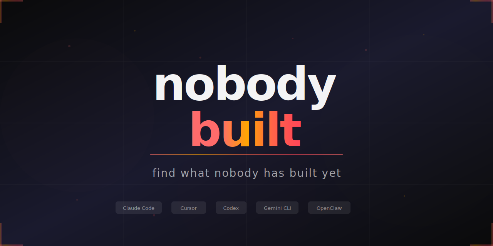

<p align="center">
  
</p>

<p align="center">
  <a href="https://github.com/KeWang0622/nobodybuilt/stargazers"></a>
  <a href="https://github.com/KeWang0622/nobodybuilt/network/members"></a>
  <a href="LICENSE"></a>
</p>

<p align="center">
  
  
  
  
  
  
  
</p>

<h3 align="center">Stop building the 50th todo app. Find the tool <i>nobody</i> has built yet.</h3>

---

**nobodybuilt** is an AI agent skill that searches GitHub, Product Hunt, Reddit, npm, app stores, and AI tool directories to find **genuinely unexplored ideas** with viral potential — then generates a complete, publish-ready project with code, README, and launch strategy.

> **"I can't believe nobody built this yet."** — That's the reaction you want. This skill finds those ideas systematically.

## Install

```bash
# One-liner — clone and install
git clone https://github.com/KeWang0622/nobodybuilt.git && cp nobodybuilt/SKILL.md ~/.claude/skills/nobodybuilt.md
```

Or just grab the skill file:

```bash
# Copy SKILL.md into your agent's skills directory
cp SKILL.md ~/.claude/skills/nobodybuilt.md
```

<details>
<summary>Other agents (Cursor, Codex, Gemini CLI, Windsurf, Aider)</summary>

| Agent | Install |
|-------|---------|
| **Cursor** | Copy SKILL.md to `.cursor/rules/nobodybuilt.md` |
| **Codex CLI** | Add SKILL.md content to agent instructions |
| **Gemini CLI** | Add SKILL.md content to agent instructions |
| **Windsurf** | Add to Cascade rules |
| **Aider** | Copy to `.aider/prompts/nobodybuilt.md` |
| **Any AI chat** | Paste SKILL.md content as system prompt |

</details>

## Usage

```
# Guided — tell it what excites you
Use nobodybuilt. I'm into cooking and meal prep.

# Auto-discovery — let it surprise you
Use nobodybuilt. Surprise me with the most viral unexplored idea right now.

# Niche-specific
Use nobodybuilt. Find a tool for Pokemon fans that would blow up on Twitter.

# Platform-specific
Use nobodybuilt. Find me a Chrome extension idea that doesn't exist yet.

# Iterate
Combine idea 1 and 3.  /  More like idea 2.  /  Same idea but as a CLI.
```

## How It Works

Most "idea generators" just brainstorm. **nobodybuilt** validates with real search data.

```
You say "cooking"
        │
        ▼
┌─────────────────────────────────────────────────────────────┐
│  PHASE 1  Creative Ideation                                 │
│  Mashup, Annoyance Autopsy, What-If, Audience Flip,         │
│  Format Shift → 15-20 raw idea fragments                    │
└──────────────────────────┬──────────────────────────────────┘
                           ▼
┌─────────────────────────────────────────────────────────────┐
│  PHASE 2  Deep Research                                     │
│  GitHub, Product Hunt, Reddit, npm, Chrome Web Store,       │
│  AI directories, niche platforms → map what exists           │
└──────────────────────────┬──────────────────────────────────┘
                           ▼
┌─────────────────────────────────────────────────────────────┐
│  PHASE 3  Validate & Score                                  │
│  Demand proof (Reddit wishlists, manual workarounds)         │
│  Anti-pattern filter → 9-factor scoring → Top 3             │
└──────────────────────────┬──────────────────────────────────┘
                           ▼
┌─────────────────────────────────────────────────────────────┐
│  PHASE 4  Build the Winner                                  │
│  Name (collision-checked) + working code + viral README +   │
│  launch strategy with draft posts for Reddit, HN, X         │
└─────────────────────────────────────────────────────────────┘
```

## Example Output

> ### 1. fridge-to-feast
> *Snap your fridge, get a week of meals with a grocery list*
>
> **Pain** 8 · **Blue Ocean** 9 · **Need** 9 · **Instant** 7 · **Name** 8 · **Trend** 8 · **Share** 9 · **Moat** 5 · **Build** 6 = **168/190**
>
> **The insight:** Meal planning apps exist. Recipe apps exist. But nothing takes a fridge photo → generates a WEEK of meals → outputs a shopping list grouped by store aisle. The closest tools require manual ingredient input.
>
> **Evidence:** Searched GitHub for "fridge meal planner", "fridge to recipe", "photo grocery list" — found 3 repos, all abandoned (last commit 2+ years ago). Reddit r/mealprep has weekly "I wish there was an app that..." threads.
>
> **The share moment:** Side-by-side of messy fridge photo → beautiful weekly meal calendar with nutritional breakdown. Screenshot-bait.

Then it generates the complete project — SKILL.md, README, code, and a launch plan with draft Reddit/HN/X posts.

## What You Get

| Output | Details |
|--------|---------|
| **3 scored ideas** | Ranked on 190-point scale, with search evidence proving the gap |
| **Validated name** | Collision-checked on GitHub, npm, and web — confirmed available |
| **Complete code** | Working v1 — SKILL.md, CLI, extension, or web app. Not stubs. Runnable. |
| **Viral README** | Hook-first, one-command install, 3 usage examples, "why this exists" |
| **Launch strategy** | Draft posts for Reddit/HN/X, directory submissions, timing advice |

## Scoring System

Every idea is scored on 9 weighted factors with calibrated benchmarks.

| Factor | Wt | 10 = | 1 = |
|--------|----|------|-----|
| **Pain Point** | 3x | Reddit threads with 500+ upvotes complaining | "Nice to have" nobody mentions |
| **Blue Ocean** | 3x | Zero results on GitHub, PH, anywhere | Multiple well-maintained tools |
| **"I Need This"** | 3x | You stop and think "wait, I want this" | You have to explain why anyone would |
| **Instant Value** | 2x | `npx tool` and it works. No config. | Needs API keys, database, setup wizard |
| **Catchy Name** | 2x | Name IS the pitch ("Shazam") | Generic ("my-tool") |
| **Trend Alignment** | 2x | Enabled by something launched this month | Could've been built 5 years ago |
| **Shareability** | 2x | Output so good people MUST screenshot it | Correct but boring |
| **Moat** | 1x | Network effects, unique data, "standard" status | Anyone could clone it |
| **Feasibility** | 1x | Single file, 2-hour build | Needs infra and multiple services |

**Max: 190.** Top 3 presented with evidence.

## Creative Ideation Methods

Not just gap-searching — active idea generation:

| Method | Formula | Example |
|--------|---------|---------|
| **Mashup** | Domain A × Domain B | Duolingo = language + gaming |
| **Annoyance Autopsy** | List frustrations → build the fix | "I hate copying recipe ingredients to my shopping list" |
| **"What If"** | Impossible thing + simple input | "Mass-unfollow inactive Twitter accounts in one click" |
| **Audience Flip** | Dev tool → make it for non-devs | GitHub contribution graph → but for gym workouts |
| **Format Shift** | Web app → CLI / SaaS → open source | Canva → but as a CLI for developers |

## Anti-Pattern Filter

Ideas get killed before you see them:

| Trap | Why |
|------|-----|
| "Dashboard for X" | No wow moment, competes with everything |
| "AI wrapper, no angle" | Everyone has this idea already |
| "Yet another todo app" | 10,000+ exist |
| "Requires behavior change" | New daily habits almost always fail |
| "Needs large user base" | Network effects impossible solo |
| "Too broad to be catchy" | "Productivity toolkit" = nothing |

## How Is This Different?

| | **nobodybuilt** | Typical idea generators | Skill factories |
|---|---|---|---|
| **Finds ideas** | Searches 8+ platforms for real gaps | Brainstorms from training data | N/A — you bring the idea |
| **Validates demand** | Reddit wishlists, manual workarounds, search evidence | No validation | No validation |
| **Kills bad ideas** | Anti-pattern filter + calibrated scoring | Everything sounds good | N/A |
| **Checks name collisions** | GitHub + npm + web search | No | No |
| **Generates code** | Complete runnable v1 | Maybe a description | Template-based |
| **Launch strategy** | Draft posts, timing, directory targets | No | No |
| **Creative frameworks** | 5 ideation methods (mashup, what-if, etc.) | Random brainstorm | N/A |

## Iteration

Don't like the results? Keep going:

- **"More like this"** — 3 more ideas in the same direction
- **"Combine 1 and 3"** — Merge ideas into a hybrid
- **"Same idea, different platform"** — CLI to extension, skill to web app
- **"Pivot"** — Same domain, completely different angle
- **"Go deeper"** — Second research pass with refined queries

<details>
<summary><b>Full Feature List</b></summary>

### Research Sources
- GitHub repos, stars, forks, awesome-lists, topics
- Product Hunt launches and traction data
- Chrome Web Store and extension marketplaces
- npm, PyPI, crates.io packages
- Reddit wishlists, X complaints, HN gaps
- AI tool directories (ClawHub, skills.sh, GPT Store, FutureTools)
- Niche platforms (itch.io, Figma Community, Splice, etc.)

### Ideation Techniques
- Mashup method (cross-domain combination)
- Annoyance Autopsy (frustration-first ideation)
- "What If" method (impossibility framing)
- Audience Flip (re-target existing tools)
- Format Shift (platform/format translation)
- Cross-pollination scan (adjacent domain analysis)

### Validation
- Demand signals (Reddit/X/HN "I wish..." searches)
- Manual workaround detection
- Adjacent tool popularity as demand proxy
- Search volume inference
- Collision detection (GitHub, npm, web)

### Output Formats
- AI agent skills (SKILL.md)
- CLI tools (Node.js, Python, Rust)
- Browser extensions
- Web apps
- Discord/Slack/Telegram bots
- Any platform that fits the idea best

### Launch Strategy
- Draft posts for Reddit, HN, X (platform-specific framing)
- Money screenshot specification
- Awesome-list and directory submission targets
- Timing optimization
- Follow-up content plan (blog, video, thread)

</details>

## Why This Exists

There are millions of repos on GitHub. Most are clones. Meanwhile, entire domains have **zero good tools** and massive unmet demand sitting in Reddit threads and unanswered tweets.

The most successful tools follow the same pattern: **be first in a real category, not 50th in a crowded one.** This skill finds those categories before anyone else does.

## Contributing

Found a tool idea using nobodybuilt? [Share it in the showcase](https://github.com/KeWang0622/nobodybuilt/issues/new?template=idea-showcase.md)!

Ideas for improving the skill: open an issue or PR.

## License

[MIT](LICENSE) — do whatever you want with it.

---

<p align="center">
  <b>If this helped you find something worth building, <a href="https://github.com/KeWang0622/nobodybuilt">give it a star</a></b> so others find it too.
</p>
